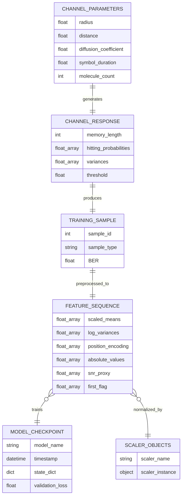
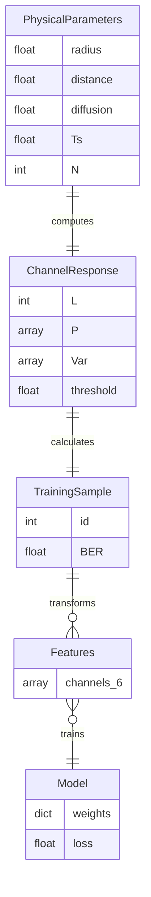

# Information Structure - ER Diagram

## Entity-Relationship Diagram

## ER Diagram

## Data Flow Description

### 1. Physical Channel Parameters
- **Attributes**: radius, distance, diffusion coefficient, symbol duration, molecule count
- **Source**: Randomly sampled from uniform distributions
- **Purpose**: Define the molecular communication channel

### 2. Channel Response
- **Attributes**: memory length (L), hitting probabilities (P[0..L-1]), variances, threshold
- **Derived from**: Physical parameters via analytical formulas
- **Purpose**: Characterize channel impulse response and ISI

### 3. Training Sample
- **Attributes**: sample ID, sample type (physics/synthetic), BER value
- **Derived from**: Channel response via $2^L$ sequence evaluation
- **Purpose**: Ground truth labels for supervised learning

### 4. Feature Sequence
- **Attributes**: 6-channel tensor (means, variances, position, abs, SNR, first-flag)
- **Derived from**: Training sample via log transformations and standardization
- **Purpose**: Model input representation

### 5. Model Checkpoint
- **Attributes**: model name, timestamp, state dictionary, validation loss
- **Produced by**: Training process
- **Purpose**: Persistent storage of trained weights

### 6. Scaler Objects
- **Attributes**: scaler name, fitted StandardScaler instance
- **Produced by**: Preprocessing on training data
- **Purpose**: Consistent normalization for inference

## Key Relationships

- **generates**: Physical parameters uniquely determine channel response
- **produces**: Channel response produces one training sample (BER value)
- **preprocessed_to**: Each training sample transforms to one feature sequence
- **trains**: Many feature sequences collectively train one model
- **normalized_by**: Feature sequences require scaler objects for standardization
