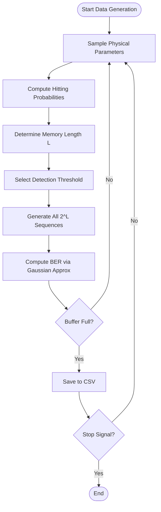
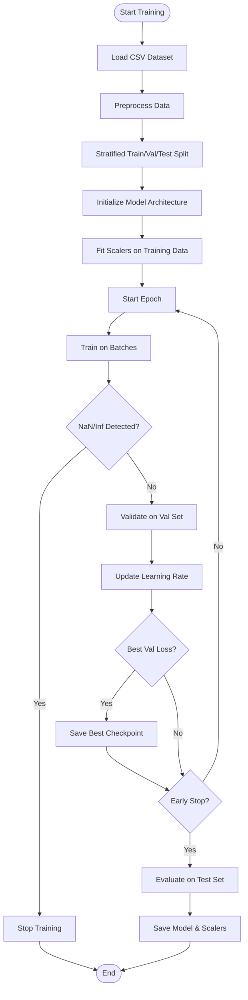
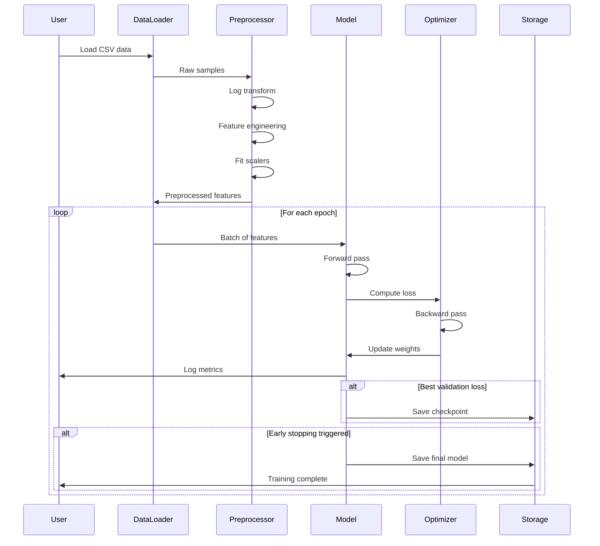
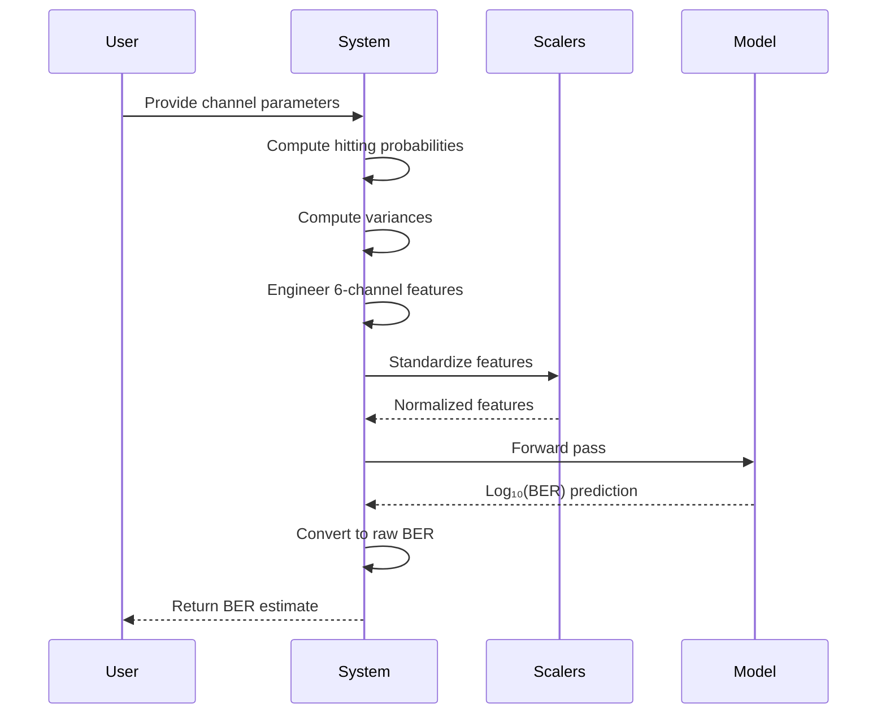
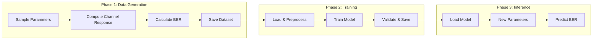
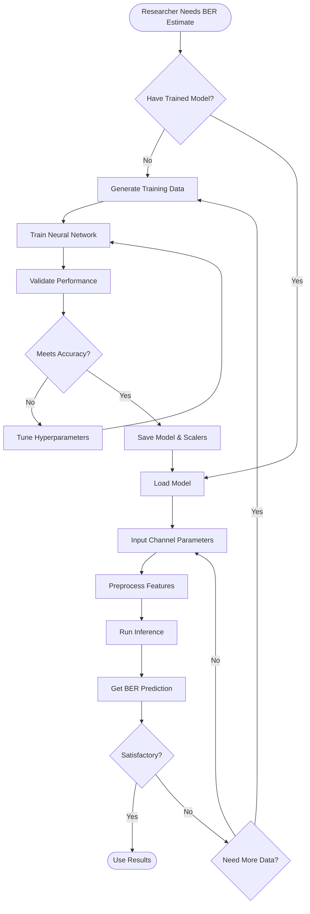
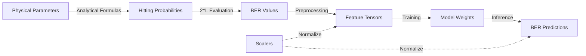

# Information Flow Diagrams

## 1. Activity Diagram - Data Generation Process

## 2. Activity Diagram - Model Training Process

## 3. Sequence Diagram - Training Workflow

## 4. Sequence Diagram - Inference Workflow

## 5. Activity Diagram - Complete Pipeline

## 6. Business Process Model - System Workflow

## 7. Data Flow Diagram

## Process Descriptions

### Data Generation Process
1. Sample physical parameters from uniform distributions
2. Compute hitting probabilities using erfc-based formulas
3. Determine adaptive memory length based on 70% coverage
4. Select detection threshold from realistic range
5. Generate all 2^L bit sequences
6. Calculate BER for each sequence using Gaussian approximation
7. Average BER across all sequences
8. Save to CSV when buffer is full
9. Repeat until interrupted

### Training Process
1. Load CSV dataset and validate columns
2. Apply log transformations to handle wide ranges
3. Engineer 6-channel feature sequences
4. Fit StandardScalers on training data
5. Split data with stratification (70/15/15)
6. Initialize model architecture
7. For each epoch:
   - Train on mini-batches
   - Check for numerical instabilities
   - Validate on validation set
   - Update learning rate if plateau detected
   - Save checkpoint if best validation loss
   - Check early stopping criterion
8. Evaluate on test set
9. Save final model and scalers

### Inference Process
1. Load trained model checkpoint and scalers
2. Accept new physical channel parameters
3. Compute hitting probabilities and variances
4. Construct 6-channel feature sequence
5. Apply standardization using loaded scalers
6. Run forward pass through model
7. Convert log₁₀(BER) prediction to raw BER
8. Return prediction to user
