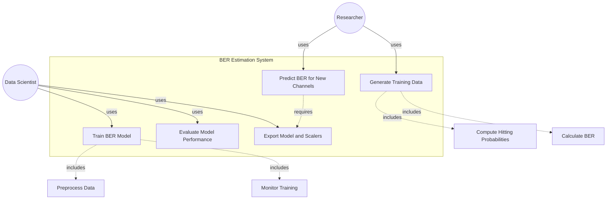
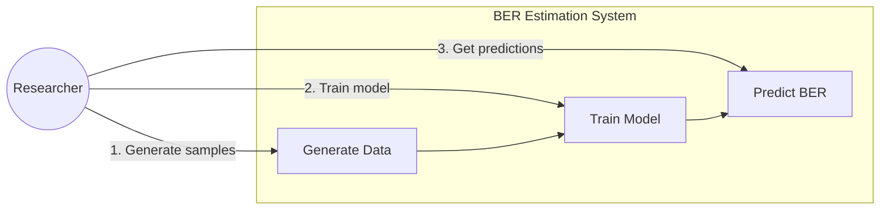

# Use Case Diagram for BER Estimation System

## Use Case Diagram



## Use Case Diagram



## Textual Description

### Actors
- **Researcher**: Uses the system to estimate BER for molecular communication channels
- **Data Scientist**: Develops and optimizes the ML models

### Use Cases

**UC1: Generate Training Data**
- Actor: Researcher
- Description: Generate physics-based and synthetic samples with BER labels
- Includes: Compute hitting probabilities, calculate BER

**UC2: Train BER Model**
- Actor: Data Scientist
- Description: Train neural network on generated dataset
- Includes: Preprocess data, monitor training metrics

**UC3: Evaluate Model Performance**
- Actor: Data Scientist
- Description: Assess model accuracy on test set across BER regimes

**UC4: Predict BER for New Channels**
- Actor: Researcher
- Description: Input channel parameters and receive BER prediction
- Requires: Trained model and scalers (UC5)

**UC5: Export Model and Scalers**
- Actor: Data Scientist
- Description: Save trained model and preprocessing scalers for deployment

## For LaTeX Document

If you want to include this in your LaTeX report, you can:

1. **Option 1**: Render the Mermaid diagram as an image and include it:
```latex
\begin{figure}[h!]
\centering
\includegraphics[width=0.8\textwidth]{figures/use_case_diagram.png}
\caption{Use case diagram for BER estimation system}
\label{fig:usecase}
\end{figure}
```

2. **Option 2**: Use a simple textual description:
```latex
\subsection{Use Case Description}

The system supports two primary actors:

\textbf{Researcher:} Uses the system to estimate BER values for molecular communication channels by providing physical parameters (radius, distance, diffusion coefficient, etc.) and receiving instant predictions.

\textbf{Data Scientist:} Develops and maintains the ML models by generating training data, training neural networks, and evaluating model performance.

\textbf{Primary Use Cases:}
\begin{enumerate}
    \item Generate training data from physical channel models
    \item Train BER prediction model on generated dataset
    \item Evaluate model performance across BER regimes
    \item Predict BER for new channel configurations (inference)
\end{enumerate}
```
